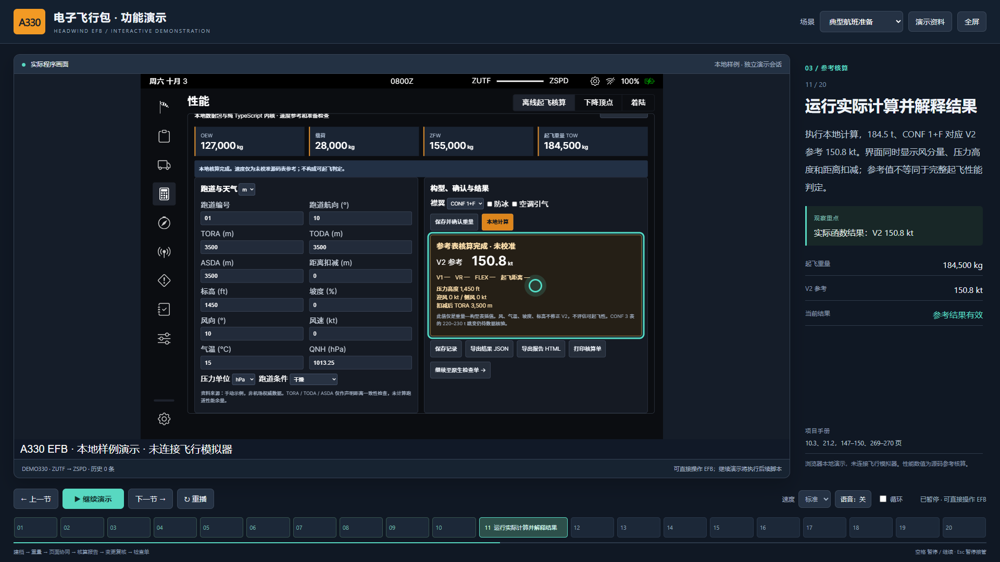

# A330EFB

A330 电子飞行包本地演示、航班工作台与中文技术文档。基于固定版本的 **Headwind A330-941** 和 **FlyByWire** 构建，提供可实际操作的 EFB，以及同步讲解的投标自动演示。



## 下载、构建和启动

准备 Git、Node.js **24.14.0**（已验证版本，最低 20.19）以及 Python **3.10+**，并将它们加入 PATH。首次下载依赖需要互联网；构建后，三套演示场景可以离线运行。

```sh
git clone https://github.com/jayremsen-netizen/A330EFB.git
cd A330EFB
npm ci
npm run build
npm run demo
```

打开 **http://127.0.0.1:9698/demo.html?autoplay=1** 自动演示。`npm run demo` 在终端前台运行，按 Ctrl+C 停止。

Windows 用户完成构建后，也可双击 **[启动投标演示.cmd](启动投标演示.cmd)**；它启动后台服务并打开默认浏览器。双击 **[停止投标演示.cmd](停止投标演示.cmd)** 停止对应服务。也可用 `Build-EFB.ps1` 完成安装依赖和构建。

普通 EFB 使用 `npm start`，地址为 http://127.0.0.1:9697/ 。开发模式使用 `npm run dev`，地址为 http://127.0.0.1:9696/ 。如端口已被其他进程占用，请先停止该进程对应的服务，或用 `node local-efb/server.cjs --port 9798` 选择空闲端口。

### 上游引用方式

本仓库只记录上游的 **Git 子模块链接及固定提交**，不提交上游源码副本、`node_modules`、Node.js 二进制或上游构建产物。

| 引用 | 固定提交 | 本地位置 |
|---|---|---|
| [Headwind aircraft](https://github.com/headwindsim/aircraft) | `41eace79ed442696a6361dc72947954c9a6cf5cb` | `upstream/headwind` |
| [FlyByWire aircraft](https://github.com/flybywiresim/aircraft) | `1bf4b8edccf84d0fb83d0eb15e42f2c773e09582` | `upstream/flybywire` |

`npm run build` 自动按 [config/upstreams.json](config/upstreams.json) 下载固定提交，只检出 EFB 所需目录；不下载飞机三维模型或 `aircraft-large-files`。**不需要 `git clone --recurse-submodules`**，因为 Headwind 自身还引用了本演示不使用的大型仓库。也可单独运行 `npm run setup` 准备上游。

从 GitHub 的 **Download ZIP** 下载本仓库后，解压并执行相同的 `npm ci`、`npm run build` 也可构建；构建脚本根据锁定清单获取上游，不依赖父目录已有的 Git 仓库。上游目录存在本地修改时，脚本会报错，不会覆盖修改。

构建会在忽略目录 `build-common/`、`build-a339x/`、`local-efb/public/` 中生成临时源码叠加、补丁和资源；从固定 Headwind 源码提取 V2 表到 `local-extensions/data/a339-reference.json`。这些文件由引用重建，不提交 Git。软件输出为 `local-efb/dist/`。

## 演示与功能

| 场景 | 内容 | 约时长 |
|---|---|---|
| 典型航班准备 | JSON 建档、人数与重量、签派/载荷/燃油联动、参考核算、历史报告、变更复核、检查单和下降顶点 | 6 分钟 |
| 地面变更与重算 | 燃油目标变化、旧结果失效、重量重新确认和新报告 | 2 分钟 |
| 专业工具巡览 | 原生载重、燃油、检查单、下降顶点和着陆计算 | 2–3 分钟 |

支持暂停接管、继续、步骤定位、重播、循环、可选中文语音、速度调整，以及真实航班/结果 JSON 和 HTML 报告导出。演示使用独立存储前缀，重播不会清除普通航班。

- [演示操作说明](演示/使用说明.md)
- [逐节讲解脚本](演示/讲解脚本.md) / [离线 HTML 阅读版](演示/讲解脚本.html)
- [可执行场景定义](local-efb/presentation/scenarios.ts)
- [项目技术方案与操作说明书：300 页 PDF](output/pdf/A330电子飞行包系统技术方案与操作说明书_重写版.pdf)
- [完整可编辑正文](manual_v2/说明书_可编辑正文.md) / [文档生成说明](manual_v2/README.md)

## 验证

```sh
npm test
npx playwright install chromium
npm run test:ui
```

`npm test` 包含 25 项独立算例、输入约束和固定源码对照检查。UI 测试会启动独立端口 19798 的服务，实际播放三个场景，检查数据隔离、暂停、定位、报告下载、失效重算、错误恢复与三种窗口尺寸。截图和结果写入忽略目录 `.artifacts/`。可通过 `EFB_TEST_PORT` 指定测试端口，`EFB_BROWSER_EXECUTABLE` 指定本机 Chromium/Chrome 程序路径。

[GitHub Actions](https://github.com/jayremsen-netizen/A330EFB/actions) 在 Windows 和 Ubuntu 上执行安装、上游获取、构建和测试。独立克隆验证见 [构建验证记录](docs/reproducibility.md)，历史演示记录位于 [docs/verification](docs/verification)，新的运行记录以实际执行结果为准。

## 目录

```text
local-efb/           本项目浏览器宿主、演示控制台、Vite 配置与静态服务器
local-extensions/    航班、重量、参考核算、历史和报告
config/             上游版本锁及本地参考模型配置
scripts/            上游获取、生成、构建与仓库审查
tests/              单元及真实浏览器场景测试
upstream/           两个 Git 子模块引用
manual_v2/          300 页手册的正文、图件和生成源码
manual/assets/      本地程序操作截图
演示/               演示使用说明、讲解稿和场景导出
```

修改本地业务或演示文件后运行 `npm run build`。只更新讲解、停留时间或步骤时编辑 `local-efb/presentation/scenarios.ts`。更新上游版本时必须同步 Git 子模块提交与 `config/upstreams.json`，检查补丁锚点并完整执行回归测试。

## 范围与来源

当前版本为浏览器本地演示，未连接 MSFS、PBNVDT、SimBrief 或订阅航图服务。起飞功能提供重量一致性、源码 V2 插值、压力高度、风分量和声明距离检查；不是完整 V1/VR/FLEX 或放行性能实现。原生着陆工具的资料边界见手册第 11 章。

本地源码按 [GPL-3.0-only](LICENSE) 提供；引用的上游代码、字体和艺术资源继续适用各自原始许可与署名要求，见 [NOTICE.md](NOTICE.md)。手册中早期工作区路径与本仓库路径的对应关系见 [docs/path-map.md](docs/path-map.md)。
