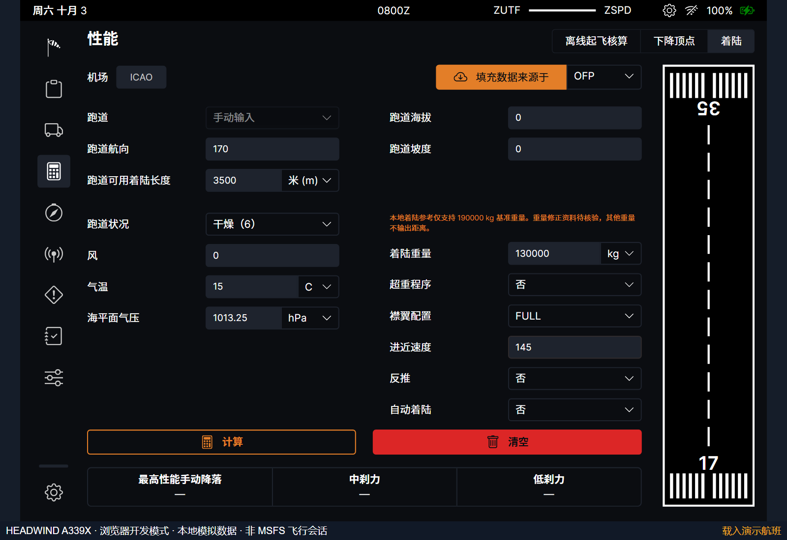
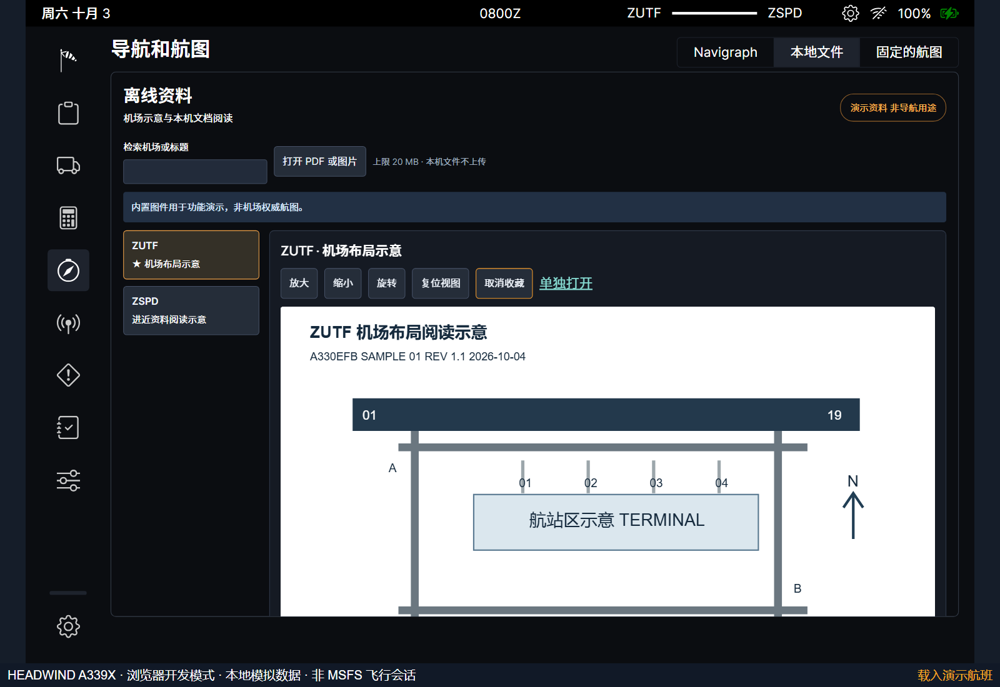
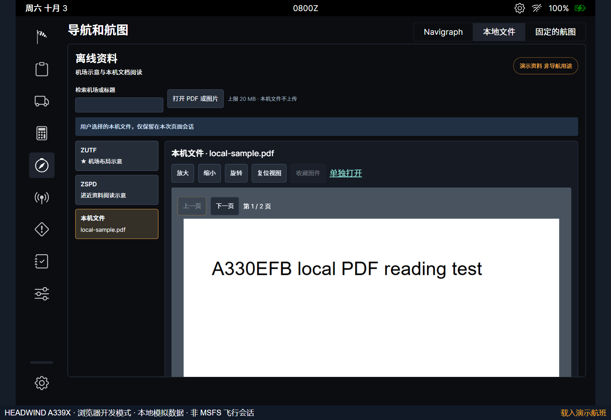
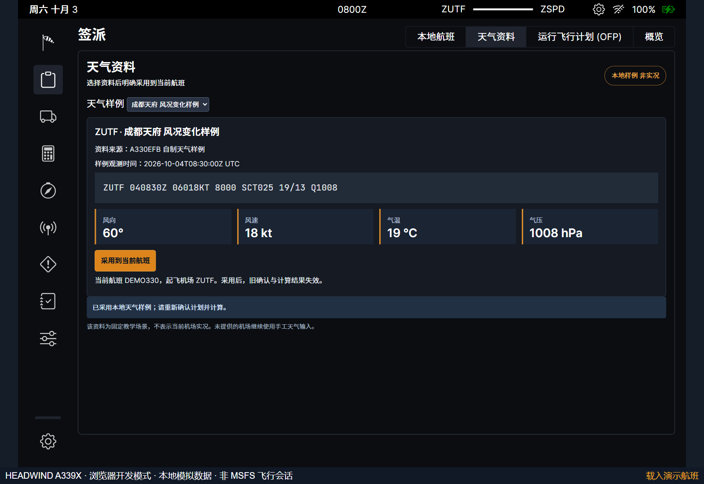
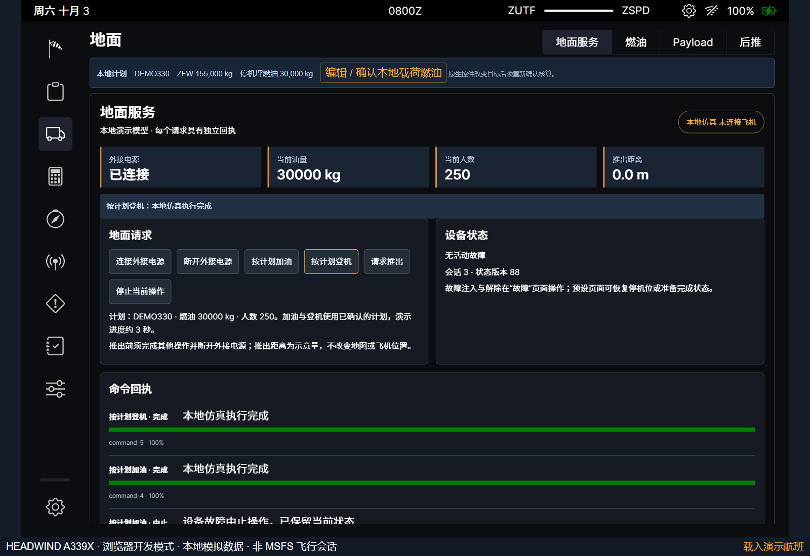
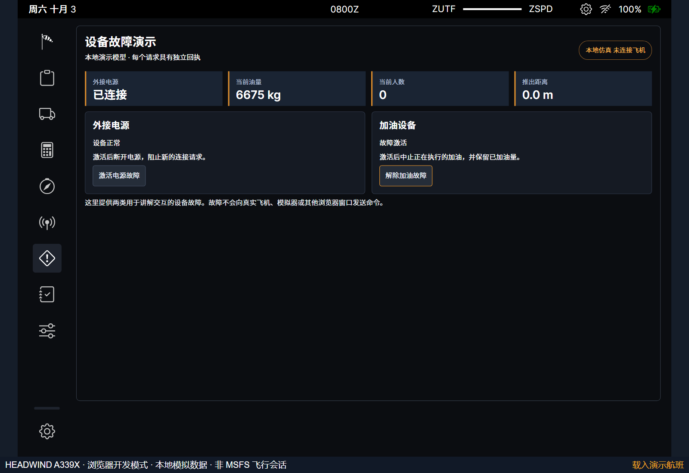
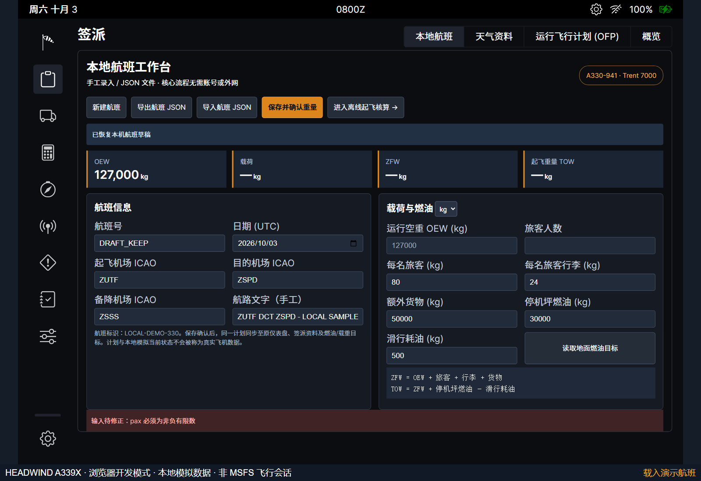
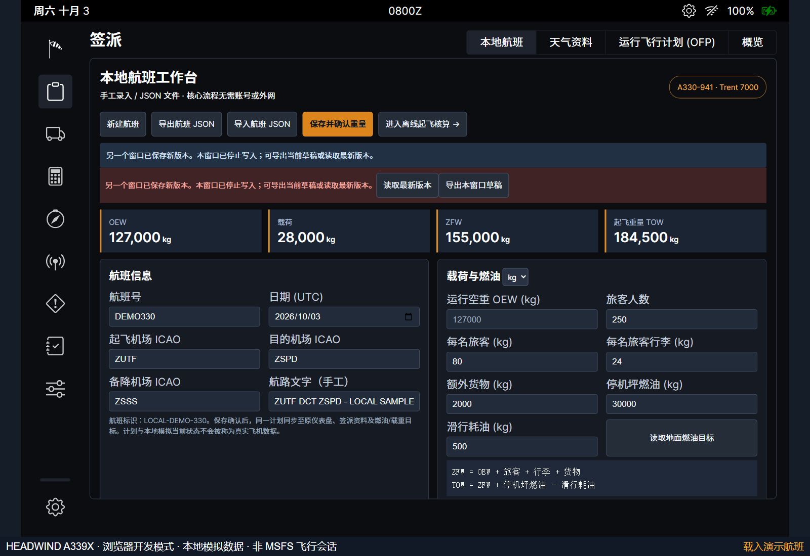

# A330EFB 1.1 操作补充说明

本文与《A330电子飞行包系统技术方案与操作说明书》文档 2.0 配套使用。以下程序画面取自本版实际运行。新增功能位于原有导航中，普通工作台与自动演示使用独立航班存储。

## 1 进入软件与核对范围

按根目录 README 构建后运行 `npm run demo`，打开 `http://127.0.0.1:9698/demo.html?autoplay=1`。场景列表现在包含四套工作流。需要自由操作时选择“暂停接管”；重新执行或定位步骤会重建该场景的前序数据。普通工作台从 `http://127.0.0.1:9698/` 进入。

性能工具提供演示参考。着陆页面仅接受 190000 kg 基准重量，130000 kg 等其他重量会显示范围提示，已有距离被清除并显示破折号。CONF 3 的 220–230 t 不输出 V2。货舱容量 44836 kg 包含行李和额外货物，不是额外货物单项上限。

## 2 离线资料阅读

进入“导航”中的本地资料页。输入机场代码或标题过滤目录，选择内置机场布局或进近阅读示意。使用“放大”“缩小”“旋转”和“复位视图”调整图件；“收藏图件”在刷新后仍保留。自带图件有明确演示标记。

点击“打开 PDF 或图片”选择本机文件，最大 20 MB，支持 PDF、PNG、JPEG。图片与 PDF 都使用页面缩放和旋转工具，PDF 还提供“上一页”“下一页”；可点击“单独打开”在浏览器中阅读。文件不上传，仅在当前资料页面会话内保留，重新进入需要再次选择。导入失败会保留当前资料并显示原因。

## 3 采用天气资料

进入“签派—天气资料”，核对机场、样例时间、原始报文和结构化参数。只有机场与当前航班出发机场相同时，“采用到当前航班”才可用。点击采用后，旧重量确认和旧核算报告失效。

返回本地航班，点击“保存并确认重量”，进入离线起飞核算并重新计算。新报告记录已采用的天气来源和时间。手工修改风、气温或气压后，来源改为手工输入。固定样例不代表机场实时天气，不能用于运行决策。

## 4 地面服务和预设

首先确认本地航班，再进入“预设”并选择“恢复停机预设”。当前状态变为电源断开、燃油 5000 kg、人数与货物为零。进入“地面—服务”，依次连接外接电源、按计划加油、按计划登机。每个请求均显示回执和进度，前一项结束后再执行下一项。

原生燃油和登机的开始标志也使用本地运行模型。地面目标有修改时，先回到航班读取、核对并确认计划；运行模型不会默认采用未经确认的新目标。命令执行时可点击“停止当前操作”，已经完成的数量保留。

需要推出时，先断开外接电源，等待断开完成，再点击“请求推出”。电源仍连接或其他操作尚未完成时，请求被拒绝并给出原因。完成后显示 30 米示意距离，不移动飞机地图位置。再次演练前恢复停机预设；“恢复准备预设”可直接采用确认计划建立准备完成状态。

## 5 设备故障与恢复

进入“故障”页，可激活外接电源故障或加油设备故障。电源故障会断开连接，后续连接请求被拒绝。加油设备故障会停止正在执行的加油，当前油量保留。故障不会影响其他浏览器窗口或真实模拟器。

点击“解除电源故障”或“解除加油故障”后，回到服务页重新提交操作。旧请求仍保留原来的失败或拒绝回执；解除故障不会自动补发旧命令。

## 6 草稿与异常数据恢复

航班录入允许暂时清空数值字段。刷新后，空字段仍为空白，航班号和其他输入保持原样；补全数据后再确认。若保存内容包含异常历史，程序隔离该项，继续显示可恢复记录，并提供“导出恢复备份”。导出的 JSON 包含原文，可用于人工复核。

本地存储失败时应立即导出航班 JSON 保存到文件。选择“新建航班”会建立新草稿；需要保留当前航班时先导出，勿把浏览器本地存储作为唯一的长期归档。

## 7 多窗口冲突处理

同一普通航班不宜同时在两个窗口编辑。其他窗口保存后，本窗口显示冲突提示并停止写入。需要保留本窗口内容时，先点击“导出本窗口草稿”；然后点击“读取最新版本”，核对航班与人数，再继续编辑。

冲突状态下不能导出当前有效核算报告。读取最新版本后，如果该版本已经确认，原生签派资料同步更新。普通航班与自动演示的存储空间相互独立，演示重播不会复位普通航班。

