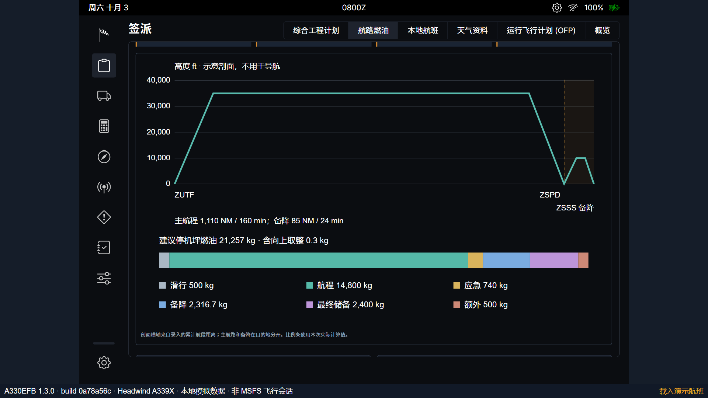
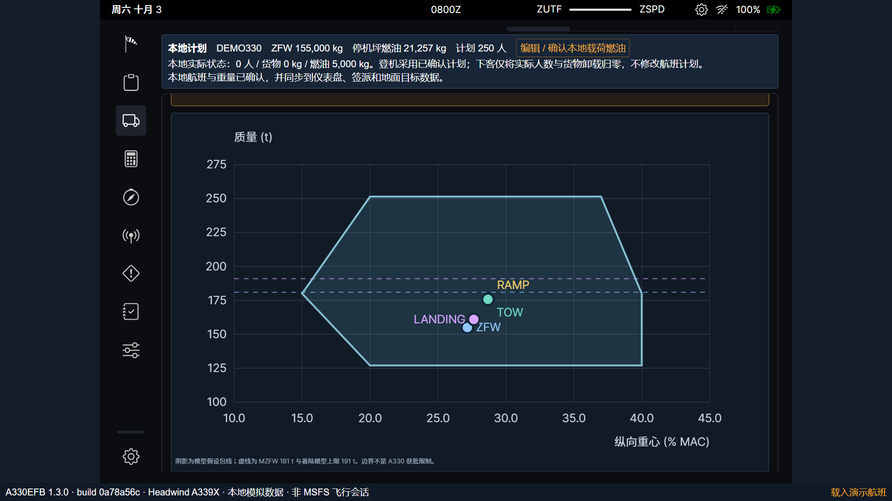
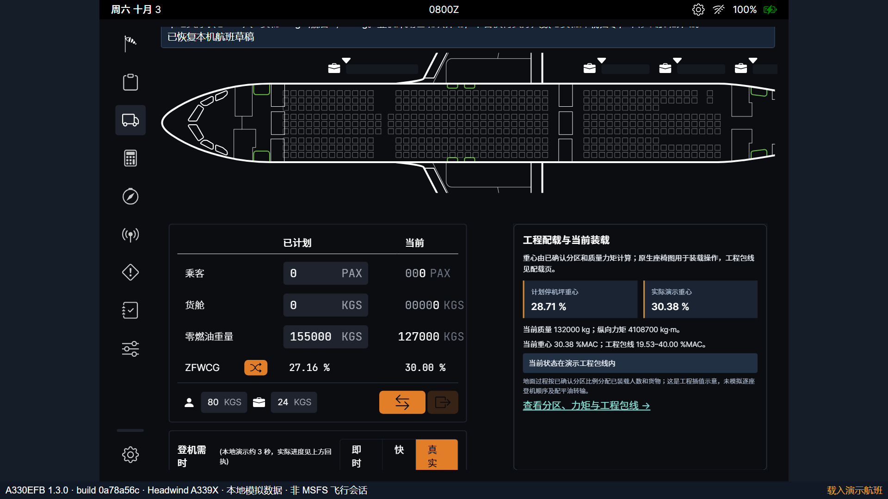
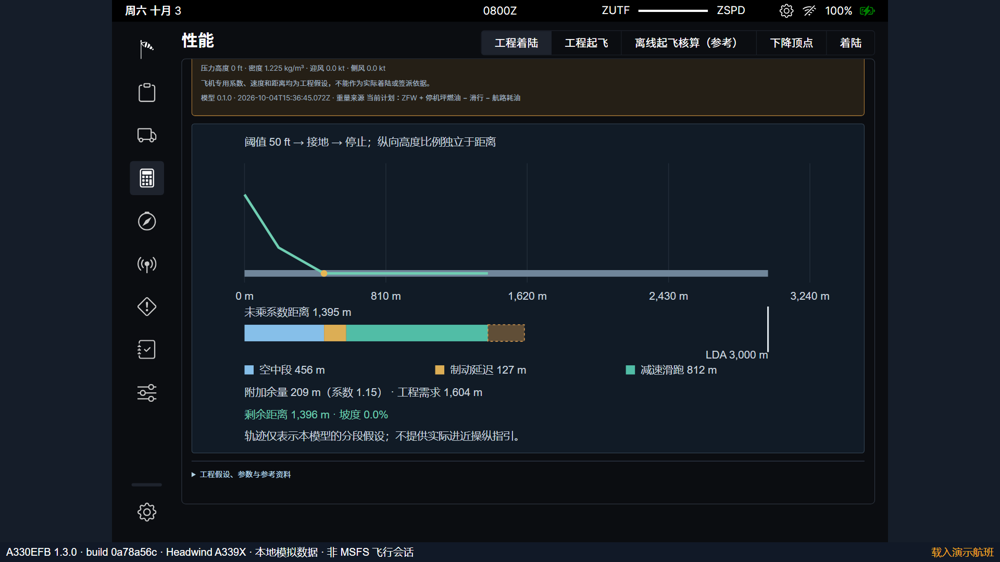
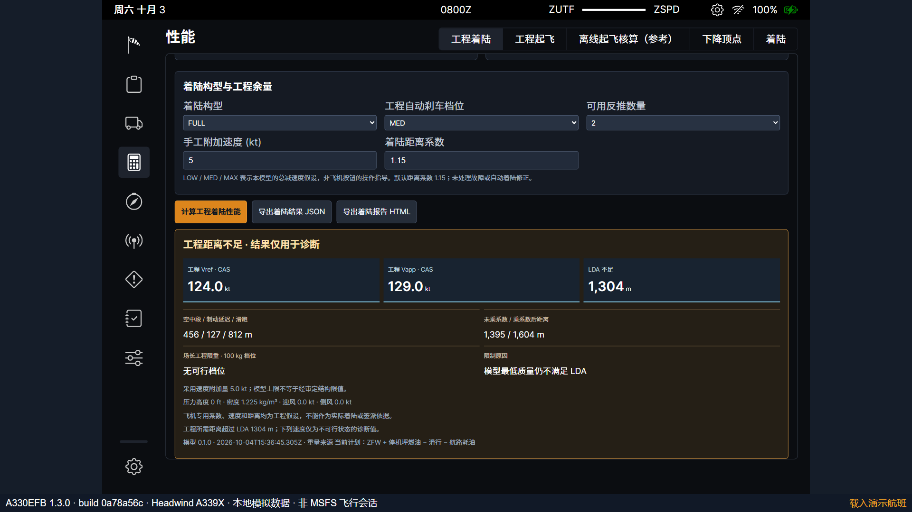
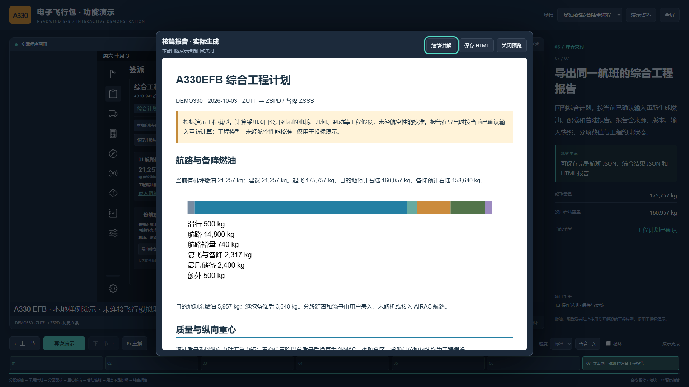

# A330EFB 1.3 操作说明

## 建立综合工程计划

进入“签派 → 综合工程计划”，选择“建立三项工程计划”。程序以当前人数、行李和货物生成分区初值，同时建立手工航路和目的地着陆样例。原航班工作台仍负责航班号、机场、总载荷和滑行燃油。

## 计算和采用燃油

进入“航路燃油”。主航路和备降的巡航距离不含已单列的爬升、复飞与下降距离；迎风填写正数，顺风填写负数。核对各阶段流量和储备策略后选择“计算航路燃油”。剖面和分项条均由当前结果生成。

选择“采用建议停机坪燃油”更新计划，然后继续配载。采用与保存确认均不代替地面加油。更换机场或航路文字后，先核对全部手工航段，再通过页面的明确关联操作采用新航班信息。

## 调整分区和确认重心

进入“配载重心”，编辑四个客舱人数、三个货舱的行李及额外货物。各组合计必须与航班工作台相同；“按计划自动分配”会明确覆盖现有分区。核对包线和目的地、备降阶段后，选择“确认配载方案”，再“保存并确认重量”。

原生载荷页右侧显示计划与地面实际演示重心。地面模型按确认分区比例装卸；尚未确认有效分区时显示“—”。

## 计算目的地与备降着陆

进入“工程着陆”，核对目标机场、跑道、独立天气、构型、制动及反推。保存确认后计算。重量来自当前计划的航路耗油账，不能直接填写未采用建议方案的重量。图中分别显示空中、延迟、制动及系数余量，与 LDA 比较。

切换备降目标时，原目的地资料暂时保留供核对，不自动当成备降资料。通过“重设为备降场工程示例”或逐项录入正确条件后，再确认和计算。

修改 LDA 等参数后，旧图和旧导出立即失效。工程距离不足时显示诊断；修正条件后必须重新确认和计算。

## 保存和自动演示

综合计划页可导出当前结果 JSON 和 HTML 报告；航班工作台的航班 JSON 还包含可继续编辑的三项输入。HTML 内含图形、来源、模型版本和快照，可在浏览器中打印。报告在导出时重新计算，正文明确标识约束状态。

自动演示选择“燃油·配载·着陆全流程”，或运行 `Start-EFB-Demo.ps1 -Scenario planning`。空格暂停／继续，Esc 暂停接管；步骤定位会重建前序输入和动作。

