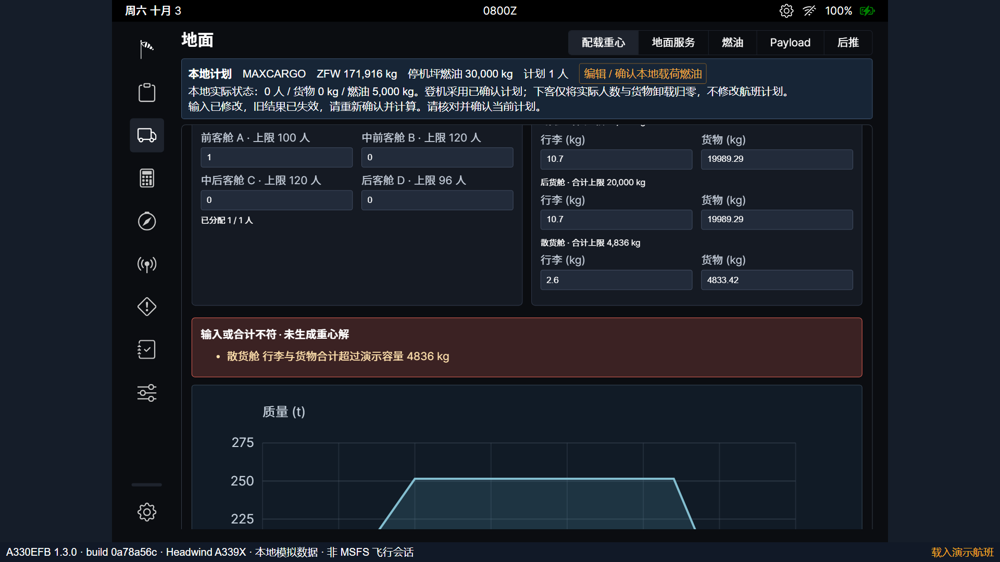
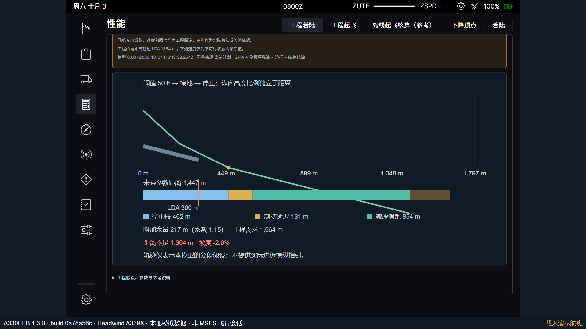

# A330EFB 1.3 软件复盘

日期：2026年10月5日。用途：投标演示。审查仓库提交为 `eb28b56352ad53ef57bfa31adb3256b717ecb277`；运行软件来自 `6a4fea2c7a3636e2b197d0e2ded6578a5ce5abf2`，版本 1.3.0，构建 `0a78a56c98dc7f34`。健康接口显示运行源码与当前工作区一致，未发现旧服务被误用。

工程起飞、航路及备降燃油、分区配载重心和工程着陆均已有实际实现。此前列出的“完整着陆工程模型、配载重心、航路及备降燃油规划”已在 1.3 中接入，不能继续列作未开发功能。当前主要不足转为边界操作、地面过程的版本管理、演示恢复和文档整合。

本轮为只读软件审查：检查源码，并在隔离的浏览器上下文执行针对性探针，没有修改产品源码、重建程序或改动用户航班。检查包括原生登机、容量边界、草稿文件回导、页面刷新、执行中修改计划和短跑道图形。没有重复执行上一轮全部回归，也没有据此扩大“验收通过”的含义。保留工程假设及适用边界属于既定投标范围，不作为本轮缺陷。

## 已复现的缺陷

### R01　P2：满货舱自动分配产生 0.02 kg 超限

在新航班中填写 1 名旅客、单人 80 kg、行李 24 kg、额外货物 44812 kg，沿用 30000 kg 停机坪燃油和 500 kg 滑行燃油。货舱合计正好为 44836 kg，基础航班校验通过。建立工程计划后点击“按计划自动分配”，程序却提示散货舱超过 4836 kg，不能确认配载。

程序分别将行李与货物按比例分配，前两个舱位向下取到 0.01 kg，把各自余数都补到最后一个舱位。两笔余数叠加后，三个货舱合计分别为 19999.99、19999.99、4836.02 kg。保持质量总量不变，将散货舱货物减少 0.02 kg，并分别向前、后货舱增加 0.01 kg 后，目的地和备降配载均通过。

代码位置：[loading/index.ts:43](../../local-extensions/loading/index.ts#L43)、[defaultLoading:51](../../local-extensions/loading/index.ts#L51)。这是分配算法问题，不应通过放宽容量校验掩盖。

建议：先按合并货量和剩余容量分配，再将行李、货物拆分；或将舍入余量分散到仍有容量的舱位。验收应覆盖恰好满载、上限内 0.01 kg、只有货物、混合行李与货物和各舱余量不足的情况，同时检查总量守恒与舱位容量。

### R02　P2：未完成草稿可以导出，但无法通过程序回导

在航班工作台清空“额外货物”，点击“导出航班 JSON”，然后选择刚导出的文件。文件中的 `freightKg` 为 `null`；程序提示“导入失败，保留原航班：freightKg 必须为非负有限数”。尚未填完的工程输入也存在同一路径。

页面用 `NaN` 表示空数值，JSON 序列化将其转换为 `null`。本机恢复已经通过 `restoreDraft` 支持这种草稿，但文件导入直接使用严格的 `parseFlight` 和 `loadFlight`。多窗口冲突中的“导出本窗口草稿”同样导出航班对象，目前没有配套的草稿导入入口。备份文件仍保留了内容，但普通用户无法在另一台机器或清除存储后通过界面继续编辑。

代码位置：[LocalPages.tsx:12](../../local-extensions/LocalPages.tsx#L12)、[导入导出入口:21](../../local-extensions/LocalPages.tsx#L21)、[flight.ts 的 parseFlight](../../local-extensions/flight.ts)、[persistence.ts:7](../../local-extensions/persistence.ts#L7)。

建议：增加带格式版本和草稿身份的文件，并使用现有草稿结构恢复逻辑；导入后撤销确认，保持空值，待完整校验通过后才能确认、计算。完整航班文件继续严格校验。验收应覆盖基础空数值、工程空数值、未填完文本、损坏结构和完整航班回导，不能用允许无效输入确认来解决。

### R03　P2：短跑道下坡着陆图侵入距离条及图例

按默认航班完成燃油、配载和重量确认，在工程着陆中填写 LDA 300 m、坡度 −2%，重新确认并计算。结果正确标为 `engineering-infeasible`，工程需求约 1664 m；图中的绿色轨迹却穿过下方距离条，并落入“减速滑跑”图例区域。

绘图的最低高度只取 LDA 终点：−6 m；本次轨迹绘制至约 1447 m，停止点高度为 −28.94 m。纵坐标未覆盖跑道外的完整诊断轨迹，导致绘图区应在 y=50–175 范围内的线延伸至 y≈285。平坡及正坡对照没有出现同样的下溢。本问题影响界面和独立着陆 HTML 报告的图，不改变计算数值与不可行状态；综合报告使用另一幅距离图。

代码位置：[landing/report.ts:10](../../local-extensions/landing/report.ts#L10)。

建议：用实际绘制的全部高度坐标和跑道端点共同求纵轴范围，保留边距；轨迹、距离条和图例采用独立绘图区。验收应覆盖 ±2% 坡度、最短 LDA、不可行超跑道轨迹和 HTML 图形，核对图形不跨入文字或图例区域。

## 运行和交付还需完善的事项

### R04　P2：执行中的地面命令缺少计划版本归属

按 30000 kg 计划启动加油；进度尚未结束时，在航班工作台把计划燃油改为 21257 kg 并保存确认。原加油继续执行到 30000 kg；确认状态为真，`groundChanged=false`，地面回执仍显示“按计划加油／执行完成”。断开外接电源的条件满足时，随后推出也可完成。

保留已经提交的目标本身可以是合理的命令语义；目前缺的是回执对旧计划和旧目标的明确标识，以及“计划已确认”与“实际地面准备满足计划”的区别。界面已有计划与实际油量，因此本项列作运行流程完善，而不是错误地要求修改计划时自动改变实际油量。

代码位置：[runtime-host.ts:25](../../local-extensions/runtime-host.ts#L25)、[setPlan:30](../../local-extensions/runtime-host.ts#L30)、[demo-runtime.ts:20](../../local-extensions/demo-runtime.ts#L20)、[SimulationPages.tsx](../../local-extensions/SimulationPages.tsx)。

建议：提交回执保存航班 ID、计划签名和操作目标；受影响计划变化后提示“按旧计划执行”，显示实际与当前目标的差额；地面准备状态单独检查，推出演示可明确提示仍有差额。验收应分别覆盖执行中修改油量、人数、货物，以及改动无关航班文字，避免对无关变更一律中止操作。

### R05　P2：刷新重置地面会话，恢复提示未说明这一点

已确认的工程航班采用“恢复准备预设”后，实际为燃油 30000 kg、250 人、8000 kg 货物，GPU 已连接。刷新页面，航班及配载确认保留，但地面模型重新变为 5000 kg、0 人、0 货物，GPU 断开，会话编号回到 1、回执清空。提示只有“已恢复本机航班草稿”。

这是内存运行模型的现有生命周期，不是草稿丢失；现场讲解过程中刷新将中断演示进度。固定时钟也仍显示星期六、10月3日、0800Z，修改航班日期为 2026-10-05 后没有变化，需要明确其场景时间身份。

代码位置：[runtime-host.ts:5](../../local-extensions/runtime-host.ts#L5)、[demo-runtime.ts](../../local-extensions/demo-runtime.ts)、[simulator-shim.ts:24](../../local-efb/simulator-shim.ts#L24)。

建议：明确选择“恢复安全检查点”或“刷新重建停机场景”两种生命周期之一。若重建，页面应直说实际装载已复位，并给出恢复准备预设的入口；若恢复，应保证进行中命令不会重复执行，并校验检查点的航班及计划身份。场景时钟应可复位或清楚标注为样例时间。验收包括完成状态刷新、操作中刷新、故障状态刷新及切换航班，不能将计划恢复与地面状态恢复混为一项。

### R06　P2：现行技术资料仍分散，Word 主手册没有形成 1.3 统一版本

README 已明确主手册为早期技术说明书 2.0，新增行为以 1.1、1.2、1.3 补充材料为准。这一说明避免了版本误称，但对投标交付，仍需读者在主手册、起飞方案和工程计划 Markdown 之间自行拼接。1.3 有实际设计、模型、操作与截图；目前没有合并进一份现行 Word 技术说明书。

依据：[README 的交付入口](../../README.md)、[manual_word/README.md](../../manual_word/README.md)、[1.3 操作说明](../planning/1.3操作说明.md)。

建议：将已实现的四个工程模块、共享数据、确认与失效规则、地面运行生命周期、综合报告和六套演示合并到现行 Word；保留历史文档作为版本资料。技术说明应按系统设计和使用组织，不把本轮修复任务表直接放成设计正文。校阅时以现行程序画面核对步骤与功能边界。

## 已检查成立的行为及仍有的产品边界

默认工程航班能够确认配载，原生“按计划登机”完成后，运行模型确为 250 人、8000 kg 货物；独立上下文没有出现浏览器脚本异常。满货舱算例调整舍入分配后，燃油预算以及目的地、备降配载均可成立。短跑道计算仍保持明确的不可行状态，旧图失效机制与本轮绘图范围问题是两件不同的事。

燃油的距离与油耗仍为手工工程输入；配载采用假设站位和固定燃油力臂；起飞和着陆采用公开列示的工程系数。投标演示的模型实现已存在，真实 A330 校准、真实航路数据库和真实运行放行不在既定验收范围。后续产品体验还可以增加同航班方案比较、分别保存目的地与备降着陆条件，以及含起飞结果的整套航班报告；本轮未把这些扩展写成现有计算错误。

建议下一轮先处置 R01–R03，补充边界回归；随后落实 R04–R05 的命令与恢复语义，最后整合 R06 文档并按自由操作流程验收。原六套自动演示应作为回归的一部分，不能代替这些异常转换的检查。

结构化证据：[findings.json](2026-10-05-v1.3/findings.json)。本机原始探针保存在 `.artifacts/review-v13/`，属于审查产物，不参与程序构建。当前记录反映上述审查基线，尚未实施本轮修复。
