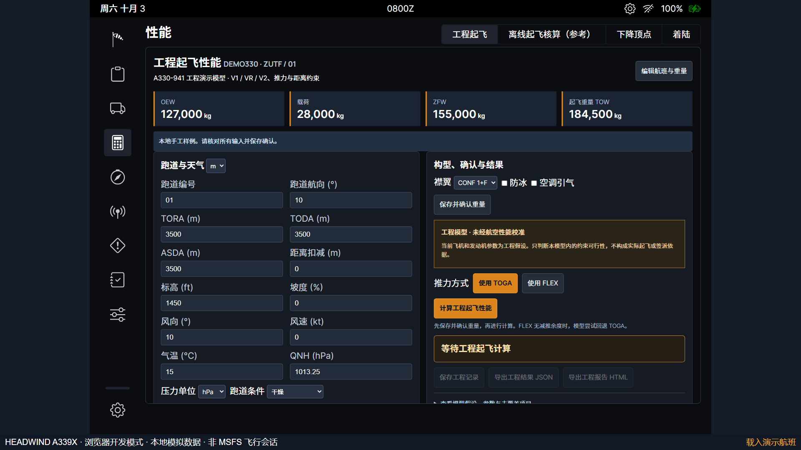
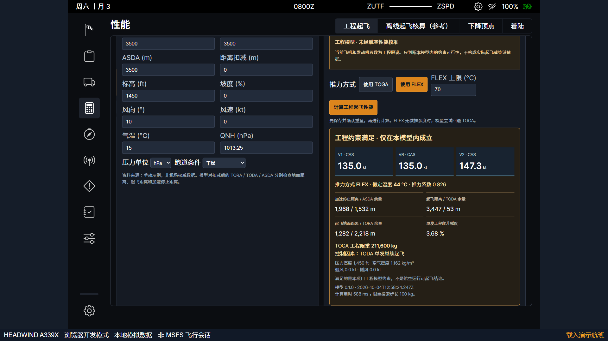
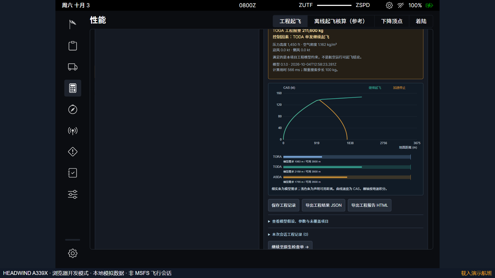
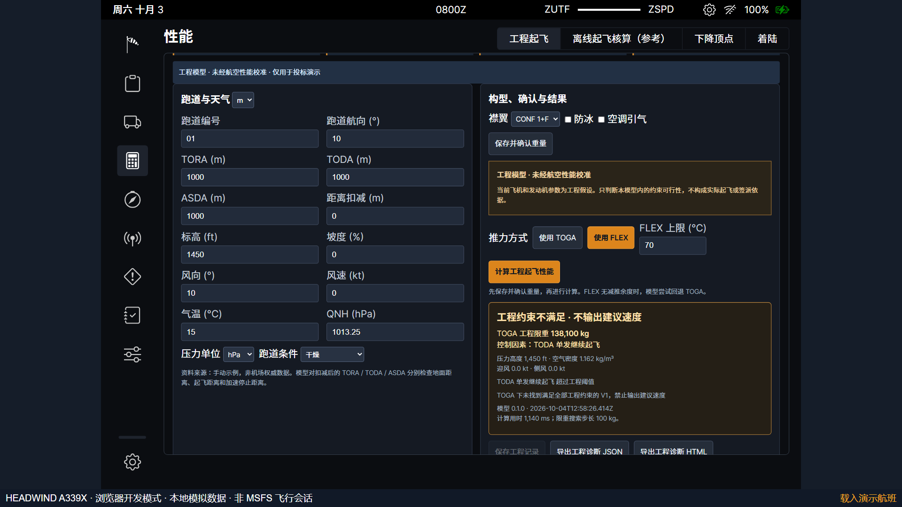
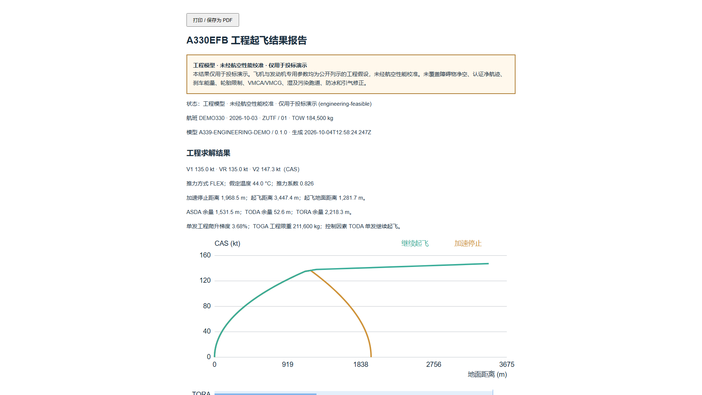

# 起飞性能操作说明

版本1.2。界面名称为“工程起飞”，用于投标演示；旧“离线起飞核算（参考）”保留源码V2查表。两个入口使用不同方法，工程结果不是旧参考表的校准或补全。

## 1 准备与确认

启动服务后，在航班工作台核对航班、人数、载荷和燃油，进入“工程起飞”。输入跑道编号、声明距离、入口扣减、标高、坡度与天气，选择襟翼，点击“保存并确认重量”。确认对象包括当前航班、跑道和天气，不只是重量字段。

首轮可用默认DEMO330：TOW184500kg，三项声明距离3500m，标高1450ft，15°C，QNH1013.25hPa，静风和CONF1+F。它是本地演示输入，不代表该机场实际跑道资料。当前模型支持干跑道、关闭防冰与引气；其他范围见模型说明。

## 2 TOGA与FLEX

选择“使用 TOGA”，点击“计算工程起飞性能”。程序同时搜索当前重量的V1以及TOGA工程限重，输出速度、距离和余量。选择“使用 FLEX”后原结果立即失效；可设置不超过70°C的工程温度上限，再重新计算。空气密度仍使用输入的实际气温。

FLEX表示本项目定义的假设温度与推力衰减关系。没有可行减推力解时，程序在TOGA可行的前提下回退并说明原因；TOGA不可行则没有建议速度。界面显示的是计算过程结果，不是机型批准数据。默认样例的FLEX为44°C；参数包变更后，应以当前重新求解结果为准。

## 3 图形解释

向下滚动查看速度与距离图。橙色轨迹为中断起飞，绿色为单发继续起飞；纵轴为CAS，横轴是按地速积分的距离。停止轨迹的终点地速为零，有迎风时CAS不一定为零。

下方三条对比带分别显示TORA、TODA、ASDA的模型需求和可用距离。限重按TOGA搜索，当前FLEX距离与TOGA限重不能混为同一推力条件。TOGA限重旁的“控制因素”说明限制重量的控制条件，不包括尚未建模的障碍物、刹车热能和轮胎限制。

## 4 条件变更与重算

把三项声明距离均改为1000m，旧结果与曲线撤下，导出按钮失效。点击“保存并确认重量”再计算，默认重量下将显示工程约束不可行，保留限重和诊断原因，不输出可采用速度。将距离恢复3500m后再次确认、计算，可以重新获得有效工程解。

改变天气、构型、推力方式或FLEX上限也会使旧结果失效。地面目标变化和窗口冲突沿用航班工作台的处理方式。空FLEX上限不能提交；湿跑道、防冰或引气等未支持条件显示超出范围，不能理解为已作真实性能判定。

“保存工程记录”只存本次页面会话；展开历史后选择“恢复工程输入（需重算）”，会恢复航班和选项，但仍须确认与重新计算。刷新浏览器会清空工程会话记录；长期保存使用导出文件。

## 5 报告和自动演示

有效结果可通过“导出工程结果 JSON”或“导出工程报告 HTML”保存。HTML文件包含打印按钮，可由浏览器打印为PDF。报告包括当前输入、模型身份、参数假设、数值、曲线与未覆盖范围。不可行或未支持时按钮改为“导出工程诊断”，标题与正常结果报告区分。

自动演示地址为 `http://127.0.0.1:9698/demo.html?autoplay=1&scenario=takeoff`。也可运行 `Start-EFB-Demo.ps1 -Scenario takeoff`。八个步骤实际执行确认、TOGA、FLEX、曲线、缩短跑道、不可行诊断、恢复及报告；可暂停接管、定位与重播。演示会话与普通航班存储隔离。

