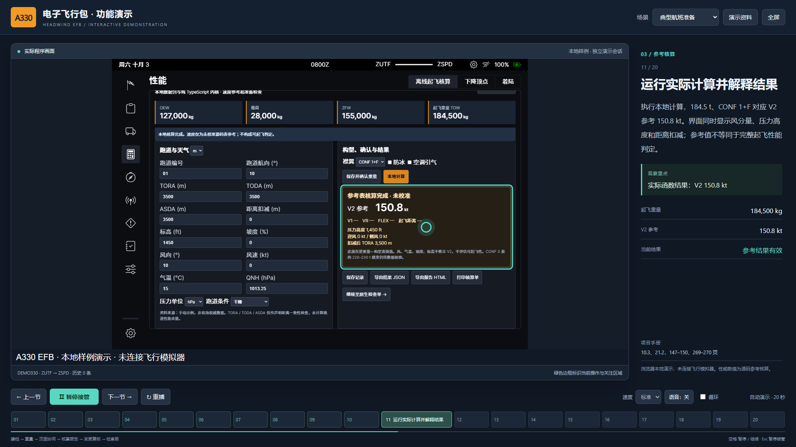
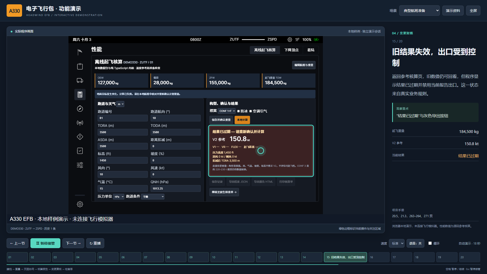
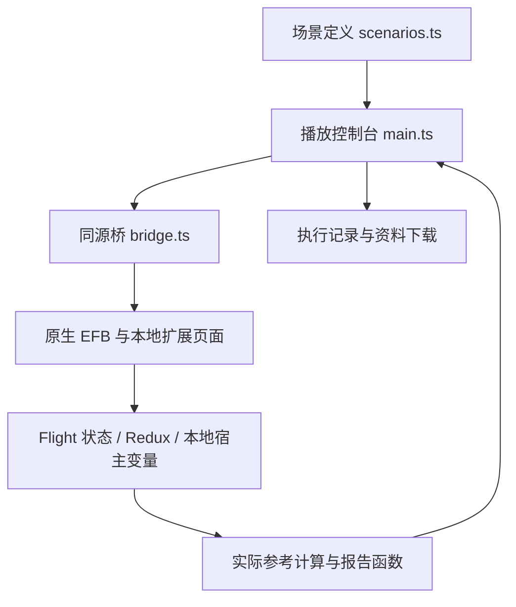

# A330 EFB 投标演示软件

本软件将 Headwind A330-941 EFB、本地航班、参考核算、工程起飞模型和自动演示控制台组合成可直接操作的现场演示。控制台自动填写表单、切换页面、点击计算和保存按钮，同时显示讲解词、关注点及对应文档章节。原有功能对应文档 2.0 和 1.1 操作补充说明；工程起飞对应 `docs/takeoff/操作说明.md`。

## 启动与现场操作

1. 按根目录 README 克隆本仓库，准备 Git、Node.js 和 Python，执行 `npm ci`、`npm run build`。构建完成后可离线运行。Windows 启动脚本适用于 Windows 10/11；浏览器使用 Chrome 或 Edge。仓库不捆绑 Node.js 或上游源码副本。
2. 双击根目录的 `启动投标演示.cmd`。浏览器会打开 `http://127.0.0.1:9698/demo.html?autoplay=1&scenario=preflight`，EFB 启动后自动播放。
3. 点击右上角“全屏”，按现场时间选择“标准”“快速”或“慢速”。默认有文字讲解；“语音：开”使用浏览器可用的中文语音，音色和离线可用性取决于电脑。
4. 点击“暂停接管”可自由操作真实 EFB。点击“继续演示”继续尚未执行的动作；修改了场景依赖的数据时，可用“重新执行本节”恢复场景。
5. 演示结束后，双击 `停止投标演示.cmd` 停止后台服务。关闭浏览器本身不会停止服务。

| 控件 | 用途 |
|---|---|
| 场景选择 | 在五套独立场景之间切换，自动复位后播放 |
| 上一节、下一节、底部步骤 | 重建前序业务状态后定位该节，不会沿用错误历史 |
| 暂停接管 / 继续演示 | 在当前动作完成处暂停，冻结讲解计时；继续后执行剩余动作 |
| 重播 | 清空本次演示会话并从第一节开始 |
| 循环 | 当前场景播完后自动重新开始 |
| 演示资料 | 暂停播放，保存航班 JSON、核算结果 JSON、报告 HTML、执行记录和场景脚本 |
| Esc | 暂停；在报告预览中同时关闭预览 |
| 空格 | 当焦点位于控制台空白区域时暂停或继续；输入框和按钮保留自身键盘行为 |

演示窗口独立使用 `9698` 端口；原普通 EFB 地址 `http://127.0.0.1:9697/` 保持可用。演示数据采用 `A339_BID_DEMO:` 存储前缀，重播只复位此类数据，不清除普通航班。请在一个浏览器标签中播放一场演示，避免多个演示标签同时复位同一演示存储。

## 五套现场场景

| 场景 | 建议用途 | 内容 |
|---|---|---|
| 典型航班准备 · 20 节，约 6 分钟 | 完整汇报 | JSON 建档、人数与重量、页面协同、V2 参考、历史报告、变更复核、检查单和下降顶点 |
| 地面变更与重算 · 7 节，约 2 分钟 | 展示业务闭环 | 基础结果、燃油目标变化、旧结果失效、重新确认、新结果和报告 |
| 专业工具巡览 · 7 节，约 2–3 分钟 | 评审追问或功能巡览 | 载重、燃油、检查单、下降顶点和原生着陆计算 |
| 资料与地面协同 · 12 节，约 3 分钟 | 展示离线资料和地面服务 | 图件、天气采用、电源、加油、登机、故障拒绝与恢复、推出 |
| 工程起飞性能 · 8 节，约 3 分钟 | 展示性能计算工程实现 | 确认计划、TOGA、FLEX、轨迹与距离余量、短跑道无解、恢复重算和工程报告 |

时长包含文字停留和实际页面操作，会随电脑性能略有变化。自动脚本在每个关键节点检查实际程序状态；未满足预期时停止并显示原因，不自动跳过失败。

直接启动工程起飞场景，可运行 `powershell -ExecutionPolicy Bypass -File .\Start-EFB-Demo.ps1 -Scenario takeoff`，或访问 `http://127.0.0.1:9698/demo.html?autoplay=1&scenario=takeoff`。控制台通过真实的“使用 TOGA”“使用 FLEX”“计算工程起飞性能”按钮操作程序。将 TORA、TODA、ASDA 改为 1,000 m 后，先演示旧结果失效，再确认重算以展示模型不可行诊断；最后恢复 3,500 m 并生成报告。

工程场景的速度、距离、FLEX 和限重由工程模型现场求解，不在讲解词中预设数值。页面展示的是模型约束可行性，不能据此说明真实 A330 已满足起飞或放行条件。模型参数、边界与操作步骤见 `docs/takeoff/资料与模型边界.md` 和 `docs/takeoff/操作说明.md`。工程页中的“演示资料”读取当前有效工程结果；结果失效时不能用旧参考核算报告替代导出。

## 重点展示及核对数值

样例航班 `DEMO330`，`ZUTF → ZSPD`，A330-941 / Trent 7000。初始旅客 250 人，每人质量 80 kg、行李 24 kg，额外货物 2,000 kg，使用空重 127,000 kg，停机坪燃油 30,000 kg，滑行耗油 500 kg。

| 演示节点 | 实际预期 |
|---|---|
| 初始重量 | 载荷 28,000 kg；ZFW 155,000 kg；TOW 184,500 kg |
| 旅客 250 → 260 | TOW 185,540 kg，增加 1,040 kg |
| 恢复 250 人并确认 | TOW 恢复 184,500 kg，相关原生页面读取同一航班 |
| CONF 1+F 参考计算 | V2 150.8 kt |
| 原生燃油目标 30,000 → 31,000 kg | 原航班计划等待核对；旧结果失效；当前报告导出禁用 |
| 读取目标并重新确认 | TOW 185,500 kg；重算 V2 151.2 kt；保留两条历史 |
| 下降顶点 | 35,000 ft → 3,000 ft，3°，约 100 NM |
| 检查单 | GEAR PINS & COVERS 项由实际点击完成 |

讲解时可围绕“同一航班输入 → 页面协同 → 结果可追溯 → 变更后重新确认”展开。逐节讲解词和手册位置见 `讲解脚本.md` 或可直接双击阅读的 `讲解脚本.html`。输入 JSON、结果 JSON 与 HTML 报告由程序实际生成；“执行记录”还包含每一步完成或失败的时间及业务状态快照。报告预览顶部提供暂停、继续和保存 HTML 按钮。

## 演示范围

当前运行的是浏览器本地演示模式，程序没有连接 MSFS 或 PBNVDT，使用固定样例和本地宿主变量。代码和界面来源保留 Headwind、FlyByWire 标识。航图订阅、实时天气、外部签派、实时仿真和机载部署不在自动场景内。

起飞功能保留重量一致性、源码 V2 表插值、风分量、压力高度和跑道声明距离扣减参考；新增工程起飞模型可求解工程 V1、VR、V2、FLEX、加速停止与继续起飞距离、TOGA 工程限重并绘制轨迹。飞机和发动机专用参数仍是工程假设，未经过航空性能校准，尚未覆盖真实障碍物、认证净航迹、刹车能量、轮胎限制、VMCA/VMCG、湿及污染跑道、防冰和引气修正。不能将这些工程计算讲解为完整 A330 性能或实际放行判定。原生着陆工具的算法适配与校准范围见重写版手册第 11 章。

开源基线以固定 Git 引用记录，构建时获取原项目及其许可文本。来源与许可见根目录 `NOTICE.md` 和 `LICENSE`。本地新增演示源码见 `local-efb/presentation`。项目的艺术资源与文本源码使用不同条款，对外分发时按相应原始条款处理。

## 故障恢复

| 现象 | 处理 |
|---|---|
| 启动后没有页面 | 重新运行启动脚本，查看命令窗口错误及 `logs/demo.stderr.log`；不要直接双击 `demo.html`，它需要本地 HTTP 服务 |
| 显示“未在 25 秒内完成启动” | 确认地址可访问，点击“重新执行本节”；先运行 `npm run build` 生成 `local-efb/dist` |
| 自动步骤失败 | 页面显示具体步骤原因，保留实际画面；可接管检查，或点击“重新执行本节”重建数据 |
| 暂停后修改数据，继续时核对失败 | 属于真实业务检查；点击重播或步骤条恢复标准场景 |
| 报告导出按钮不可用 | 当前结果未计算或已过期，先确认重量再计算；失效演示环节这是预期行为 |
| 语音没有声音 | 保留文字讲解即可；检查电脑音量和浏览器中文语音，不影响自动操作 |
| 页面过小 | 使用 1920×1080 显示器并全屏；1280×720 也可运行，原生 EFB 会按比例缩放 |

## 开发维护

`local-efb/presentation/scenarios.ts` 是可执行场景定义，包含动作、预期状态、讲解词、停留时间和文档章节。修改它后运行 `npm run build`，或在 Windows 上运行根目录 `Build-EFB.ps1` 重新构建。`场景脚本.json` 是便于审阅的导出副本，修改 JSON 本身不会改变已构建程序。

控制台 `main.ts` 管理播放、暂停和定位；`bridge.ts` 操作真实 EFB DOM，并从原有状态和计算函数读取结果；`presentation-mode.ts` 隔离本地存储。步骤跳转会建立新 iframe 会话并重放前序动作，自动核对通过后进入目标节。

回归脚本位于 `tests/`。先执行 `npx playwright install chromium`，再执行 `npm run test:ui`；测试自动启动独立服务，结果和实际截图保存到 `.artifacts/demo`。`演示/evidence` 保存已有界面截图供说明阅读，新的验证记录以实际运行结果为准。
